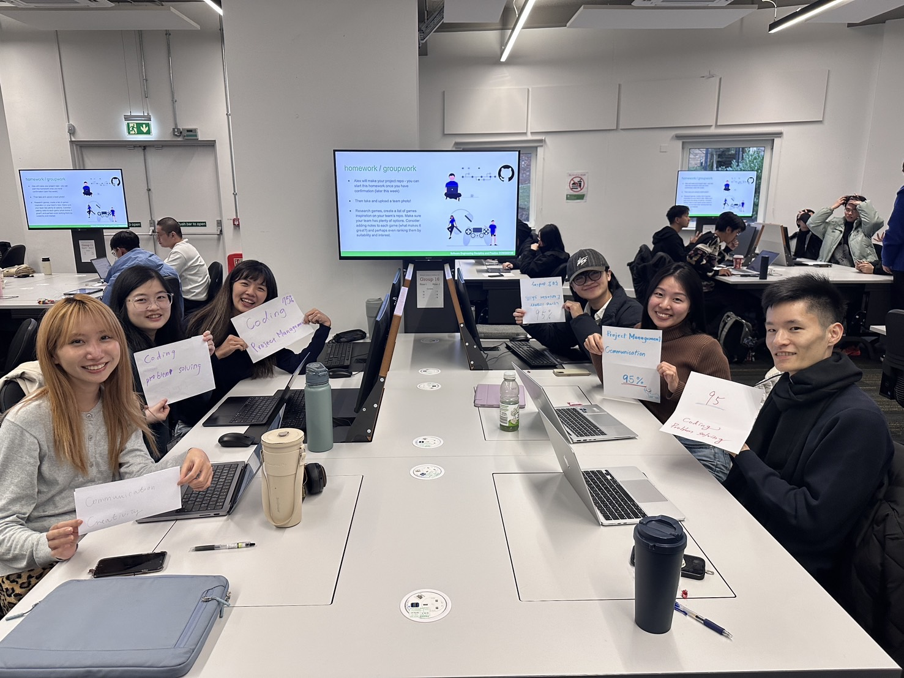

# COMSM0166 Project Template

A project template for the Software Engineering Discipline and Practice module (COMSM0166).

## Info

Please clone this repo to your team's repo. We'll be setting up your repo and assigning you to it after the group forming activity. You can delete this section after cloning, but please keep the rest of the repo structure intact.

You will be developing your game using [P5.js](https://p5js.org) a javascript library that provides you will all the tools you need to make your game. However, we won't be teaching you javascript, this is a chance for you and your team to learn a (friendly) new language and framework quickly, something you will almost certainly have to do with your summer project and in future. There is a lot of documentation online, you can start with:

- [P5.js tutorials](https://p5js.org/tutorials/)
- [Coding Train P5.js](https://thecodingtrain.com/tracks/code-programming-with-p5-js) course - go here for enthusiastic video tutorials from Dan Shiffman (recommeded!)

## Your Game

Link to your game [PLAY HERE](https://peteinfo.github.io/COMSM0166-project-template/)

Your game lives in the [/docs](/docs) folder, and is published using Github pages to the link above.

Include a demo video of your game here (you don't have to wait until the end, you can insert a work in progress video)

## Your Group

- Group member 1, Hsin Yun Fan, lt24003@bristol.ac.uk, hsinyunF
- Group member 2, Yu Qi Lin, rk24876@bristol.ac.uk, chiderlin
- Group member 3, Wei Lin, tr24015@bristol.ac.uk, vivi2393142
- Group member 4, Digo Tu, ma24030@bristol.ac.uk, digotu
- Group member 5, Zih-Cing Lan, aw24252@bristol.ac.uk, ZihcingLan
- Group member 6, CHEN PIN-RU, tz24192@bristol.ac.uk, nezii0331

## Project Report

### Game Research

| Name | Introduction | Feasibility / Challenges |
|------|--------------|-------------------------------------------------------------------------------------------|
| **Unspottable**      | Multiple players join a party game where their goal is to blend in with robots and try to identify and beat other players among the robots. | **Feasibility**: ★★★☆☆ 1. Algorithm for robot behavior. 2. Convert 3D to 2D. 3. Support simultaneous player controls. |
| **Taiko no Tatsujin**| A rhythm music game where you choose your favorite song and score points by hitting notes with perfect timing as they reach the target spots. | **Feasibility**: ★★★★☆ 1. Sync controls, music, and visuals. 2. Convert music to beat points. |
| **Scream Chicken Jumpy**| Control the chicken with your voice to move through obstacles and aim for the longest distance. | **Feasibility**: ★★★☆☆ 1. Voice detection mechanism. 2. Overlay game graphics on player video. 3. Record and replay gameplay. |
| **Super Bunny Man**  | A co-op physics platformer where players control a rabbit-costumed character. Team up locally or online to beat levels, find carrots, and race against the clock. | **Feasibility**: ★☆☆☆☆ 1. 3D to 2D transition may affect smoothness. |
| **PICO PARK**        | A cooperative puzzle game where players work together to solve unique challenges, compete in mini-games, or survive as long as possible to achieve high scores. | **Feasibility**: ★★★★☆ 1. Puzzles for cooperative play. 2. Handle latency, sync, and disconnections. 3. Infinite map generation. |
| **Pikachu Volleyball**| A single-player or two-player game where characters move back and forth to catch the ball or jump to attack and block. Points are scored when the ball lands on the ground. | **Feasibility**: ★☆☆☆☆ 1. Calculate bounce based on position and attributes. 2. Design 2D animations for different scenarios. |
| **Gang Beasts**      | A hilarious multiplayer party game with chaotic gameplay. Modes include Melee (free-for-all fights), Gang (team battles), and Waves (co-op against AI enemies). | **Feasibility**: ★☆☆☆☆ 1. Mechanics require time to master. 2. Creating strong yet soft characters is challenging. |
| **King of Fighters** | Up to 4 players can battle using a single keyboard. Modes include: versus, campaign, tournament, and War. | **Feasibility**: ★☆☆☆☆ 1. Many characters with unique skills. 2. Actions and items need to be combined. 3. Complex keyboard controls. 4. NPC enemies appear randomly. |
| **Ultimate Chicken Horse**| A party game where players build routes and place obstacles to challenge each other. Use simple movements to reach the goal while trying to block others. | **Feasibility**: ★☆☆☆☆ 1. Simultaneous controls for players. 2. Complex scoring system. 3. Issues with block and obstacle combinations. |
| **King of Opera**    | A party game where characters continuously spin while idle. Players only need to control the forward button and try to knock others off by pushing them to fall from the edge. | **Feasibility**: ★☆☆☆☆ 1. 3D to 2D transition may affect smoothness. 2. Sliding-back effect needed on hit. 3. Precise reactions for consecutive collisions. |
| **Ghost Invaders**   | A Space Invaders-inspired game featuring multiplayer controls for movement and shooting, with quick access to the menu and restart options. | **Feasibility**: ★☆☆☆☆ 1. Excessive repetition. 2. Difficulty imbalance affects player retention. |

### Introduction

- 5% ~250 words
- Describe your game, what is based on, what makes it novel?

### Requirements

- 15% ~750 words
- Use case diagrams, user stories. Early stages design. Ideation process. How did you decide as a team what to develop?

### Design

- 15% ~750 words
- System architecture. Class diagrams, behavioural diagrams.

### Implementation

- 15% ~750 words

- Describe implementation of your game, in particular highlighting the three areas of challenge in developing your game.

### Evaluation

- 15% ~750 words

- One qualitative evaluation (your choice)

- One quantitative evaluation (of your choice)

- Description of how code was tested.

### Process

- 15% ~750 words

- Teamwork. How did you work together, what tools did you use. Did you have team roles? Reflection on how you worked together.

### Conclusion

- 10% ~500 words

- Reflect on project as a whole. Lessons learned. Reflect on challenges. Future work.

### Contribution Statement

- Provide a table of everyone's contribution, which may be used to weight individual grades. We expect that the contribution will be split evenly across team-members in most cases. Let us know as soon as possible if there are any issues with teamwork as soon as they are apparent.

### Additional Marks

You can delete this section in your own repo, it's just here for information. in addition to the marks above, we will be marking you on the following two points:

- **Quality** of report writing, presentation, use of figures and visual material (5%)

  - Please write in a clear concise manner suitable for an interested layperson. Write as if this repo was publicly available.

- **Documentation** of code (5%)

  - Is your repo clearly organised?
  - Is code well commented throughout?
